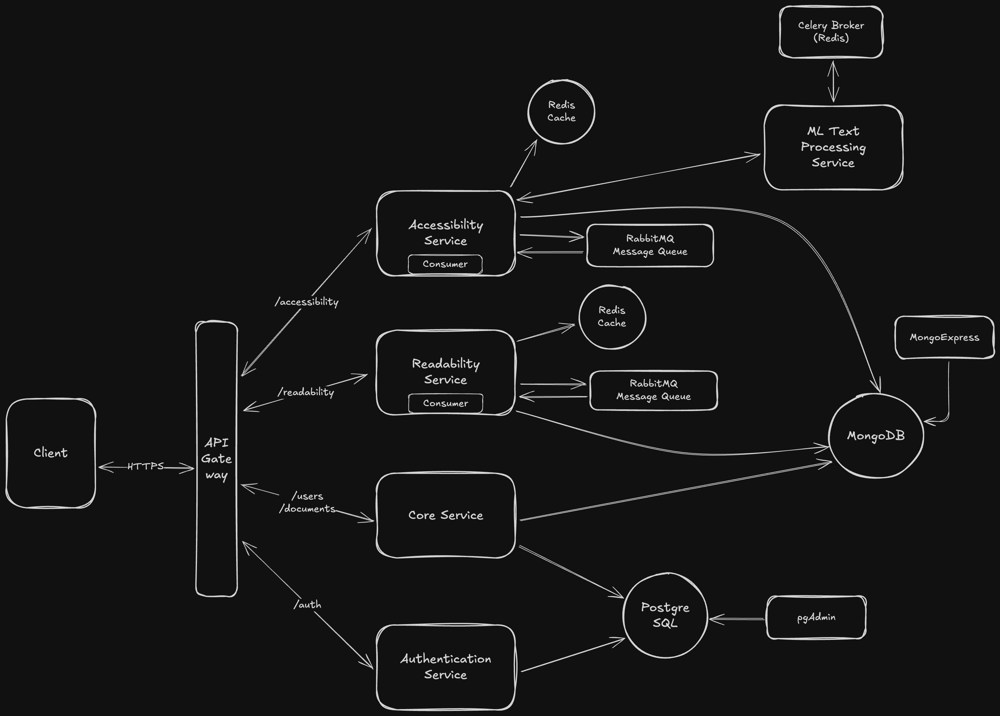

# WriteLens 📖
*An AI-powered platform for improving text readability, accessibility, and overall clarity.*

---

## Overview
**WriteLens** helps writers and editors enhance their text by analyzing readability and accessibility. The system provides actionable insights and suggestions to improve writing quality using AI and NLP algorithms.

This project is designed to showcase backend development skills, microservices architecture, and AI integration.

---

## Features
- 🚀 *Readability Analysis*: Evaluates text using metrics like Flesch Reading Ease, Gunning Fog, etc.
- 🧠 *Accessibility Checks*: Detects passive voice, jargon, and complex sentences, providing suggestions for improvement.
- ⚡ *Fast Processing*: Asynchronous task processing with RabbitMQ and Redis for scalability.
- 🔍 *API Gateway*: Centralized API management using Ocelot.
- 🐳 *Dockerized Environment*: Easily deploy and scale with Docker Compose.
- 🔐 *JWT-based Authentication*: Secure communication across services.

---

## Architecture
WriteLens follows a microservices architecture with the following key services:
1. **[Authentication Service](./WriteLens.AuthService/)**: Authenticates and authrizes users.
2. **[Core Service](./WriteLens.Core/)**: Manages users, documents, and project metadata.
3. **[Readability Service](./WriteLens.ReadabilityService/)**: Performs readability analysis.
4. **[Accessibility Service](./WriteLens.AccessibilityService/)**: Detects accessibility issues and provides suggestions.
5. **[ML Text Processing Service](./WriteLens.MLTextProcessingService/)**: AI-based text processing powered by NLP models.
6. **[API Gateway](./WriteLens.ApiGateway/)**: Routes requests and centralizes authentication.

### Architecture Diagram


---

## Tech Stack
- **Languages**: C# (.NET Core), Python
- **Databases**: PostgreSQL, MongoDB
- **Message Broker**: RabbitMQ
- **API Gateway**: Ocelot
- **Containerization**: Docker, Docker Compose
- **Caching**: Redis
- **Task Queue**: MassTransit
- **NLP Models**: OpenAI / Claude models via API integration

---

## Installation
#### Prerequisites
- Docker and Docker Compose
- .NET SDK
- Python 3.12+

#### Steps
1.	Clone the Repository:
    ```bash
    git clone https://github.com/okkostenko/WriteLens.git
    cd WriteLens
    ```
2. Set Up Environment Variables:
    - Create a ```.env``` file in the root directory.
    - Fill it with required variables (example provided in [.env.example](./.env.example)).
3. Set Up API keys for Services to Access ML Text Processing Service:
    - Create a ```api_keys.json``` file in ./WriteLens.MLTextProcessingService/data/ folder.
    - Fill it with API keys (exmaple provided in [api_keys_example.json](./WriteLens.MLTextProcessingService/data/api_keys_example.json))
4. Build and Run:
    ```bash
    docker-compose --env-file .env build
    docker-compose up
    ```

---

## Configuration

|Variable | Description|
|---------|------------|
| JWT_ISSUER | Issuer for JWT token validation|
| JWT_AUDIENCE | Audience for JWT token validation|
| JWT_SECRET | Secret key for JWT toke validation|
| JWT_EXPIRATION_IN_MINUTES| JWT token expiration time in minutes|
| POSTGRES_USERNAME | Username for PostgreSQL |
| POSTGRES_PASSWORD | Password for PostgresSQL|
| POSTGRES_DATABASE | Database name for PostgreSQL|
| MONGO_USER | Username for MongoDB|
| MONGO_PASSWORD | Password for MongoDB|
| MONGO_DATABASE | Database name for MongoDB|
| MLTAS_API_KEY | API key for services to access ML Text Processing Service (Must match API key provided in [/app/api_keys.json](./WriteLens.MLTextProcessingService/data/api_keys.json))|
| MLTAS_VALID_AUDIENCE | Valid audience for services to access ML Text Processing Service (Must match match one of the audiences provided in [/app/api_keys.json](./WriteLens.MLTextProcessingService/data/api_keys_example.json))|
| MLTAS_ALLOWED_ORIGINS | Semicolon-separated list of allowed origin for ML Text Processing Service |
| AS_RABBIT_MQ_USER | User for Accessibility Service RabbitMQ broker |
| AS_RABBIT_MQ_PASSWORD | Password for Accessibility Service RabbitMQ broker |
| RS_RABBIT_MQ_USER | User for Readability Service RabbitMQ broker |
| RS_RABBIT_MQ_PASSWORD | Password for Readability Service RabbitMQ broker |
| OPENAI_API_KEY | OpenAI API key |
| OPENAI_ORGANIZATION_ID |OpenAI organization ID |

---

## Running the Project
To run project use Docker Compose:
```bash
docker-compose up
```

---

## API Documentation
Each service exposes Swagger documentation:
- Authentication Service: http://localhost:5001/swagger
- Core Service: http://localhost:5002/swagger
- Accessibility Service: http://localhost:5003/swagger
- Readability Service: http://localhost:5004/swagger

Or use Api Gateway Swagger (http://localhost:5005/swagger) documentation to see public endpoints.

---
<!-- 
## Testing
### Unit Tests
Run unit tests for individual services:
```bash
dotnet test WriteLens.Core.Tests
```

Or test the whole project with:
```bash
dotnet test
``` -->

<!-- --- -->

## Docker Setup
```bash
docker-compose --env-file.env build
docker-compose up
```

---

## License
This project is licensed under the MIT License.
